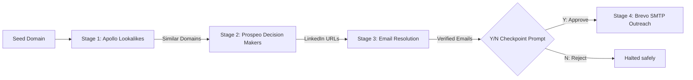
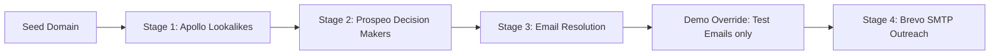
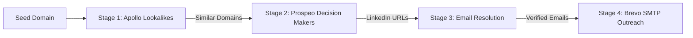
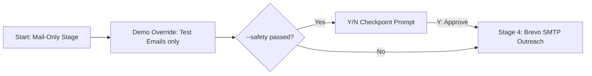

# Automated Outreach Pipeline CLI

A highly modular, resilient, 4-stage Command Line Interface (CLI) outreach tool built in Node.js. Given a single "seed" company domain, the pipeline automatically discovers lookalike companies, targets C-suite/VP-level decision-makers, resolves verified professional emails, and sends personalized cold outreach emails using a safety-controlled approval mechanism.

---

## 🚀 Architecture & Pipeline Flow

The tool operates in four distinct workflow scenarios based on the command-line flags you pass:

### 1. Scenario A: Safety Mode (`--safety` flag only)
Slices through Stages 1–3 on real prospects, renders the Safety Checkpoint table, and pauses for a **Y/N** input. Emails are sent only upon explicit user confirmation (`Y`).


* **Command:** `node index.js stripe.com --safety`

---

### 2. Scenario B: Demo Mode (`--demo` flag only)
Runs Stages 1–3 on real prospects, but overrides the final target list with test emails `project.samarops@gmail.com` and `samar@casmed.in` to allow safe sandbox dry-runs. Bypasses the safety checkpoint prompts and sends immediately.


* **Command:** `node index.js stripe.com --demo`

---

### 3. Scenario C: Full Execution / Default (No flags)
Designed for fully automated, headless growth loops. Runs Stages 1–3 on real contacts and immediately fires outreach emails to them without pause or checkpoint confirmation.


* **Command:** `node index.js stripe.com`

---

### 4. Scenario D: Mail-Only Mock Run (`--stage mail` and `--demo` flags)
Skips Stages 1–3 entirely and jumps directly to Stage 4 (Outreach) with the mock test emails (`project.samarops@gmail.com` and `samar@casmed.in`). No seed domain argument is required. Supplying optional `--safety` prompts the user for Y/N confirmation before dispatching.


* **Command:** `node index.js --stage mail --demo --safety`

---

### 🔍 Stage-by-Stage Details

1. **Stage 1: Lookalike Sourcing (`src/api/lookalikes.js`):** Enriches the seed domain using Apollo's `GET /api/v1/organizations/enrich` to find firmographics, then searches similar companies via `POST /api/v1/organizations/search`.
2. **Stage 2: Finding Decision Makers (`src/api/prospeo.js`):** Queries Prospeo `POST /search-person` for contacts at lookalike domains with seniorities of C-Suite, VP, and Director. Limits results to 3 per company for credit safety.
3. **Stage 3: Email Resolution (`src/api/prospeoEnrich.js`):** Sends target LinkedIn URLs to Prospeo `POST /enrich-person` to retrieve and verify emails.
   > [!NOTE]
   > Stage 3 is routed directly through Prospeo's Enrich Person API using your `PROSPEO_API_KEY` because Eazyreach's dashboard did not offer any way to obtain an API key (or we were unable to find it whatsoever).
4. **Stage 4: Personalized Outreach (`src/api/brevo.js`):** Personalizes HTML templates using contact data and delivers them via Brevo SMTP from your custom sender `contact@anugyajain.info`.

---

## 🛠️ Technology Stack

* **Runtime:** Node.js (CommonJS modules for maximum compatibility).
* **API Requests:** `axios` for standard HTTP clients.
* **CLI Parser:** `commander` to handle options and arguments.
* **Interactive Prompts:** `inquirer` for the safety checkpoint.
* **Styling:** `picocolors` for terminal theme coloring.
* **Environment Configuration:** `dotenv` to load keys securely.

---

## ⚙️ Setup & Installation

### 1. Prerequisites
Ensure you have **Node.js** (v16+) installed.

### 2. Install Dependencies
Clone/unzip the project folder, navigate to it, and install:
```bash
npm install
```

### 3. Configure Environment Variables
Create a `.env` file in the root directory (based on `.env.example`):
```env
# Sourcing (Apollo.io API)
APOLLO_API_KEY=your_apollo_api_key_here

# Decision Makers (Prospeo API)
PROSPEO_API_KEY=your_prospeo_api_key_here

# Email Resolution (Stage 3 uses Prospeo Enrich Person API)
# We are using Prospeo API key only because there was no option to get an Eazyreach API key from the dashboard or if there was we were unable to find it whatsoever.
# Stage 3 is fully integrated with Prospeo's /enrich-person API using PROSPEO_API_KEY.

# Outreach (Brevo API)
BREVO_API_KEY=your_brevo_api_key_here
SENDER_EMAIL=your_verified_sender_email_here
SENDER_NAME="Your Sender Name"
```

---

## 🏃 Execution

To run the pipeline against a seed domain, execute:
```bash
node index.js [seed-domain] [options]
```

### CLI Options:
* `-l, --limit <number>`: Number of lookalike companies to source (default: `3`).
* `-s, --safety`: Enables the interactive Safety Checkpoint table and Y/N confirmation prompt. **If omitted, the pipeline sends emails immediately.**
* `-d, --demo`: Demo Mode. Overrides the resolved email targets from Stages 1–3 and targets **`project.samarops@gmail.com`** and **`samar@casmed.in`** only, allowing safe, end-to-end sandbox testing.
* `-t, --stage <type>`: Execution stage: `exec` (performs stages 1 to 4; default) or `mail` (only initiates the mail section; when combined with `--demo`, it skips stages 1-3 entirely and runs only the mock mail).


### Examples:
* **Demo Sandbox (targets test inboxes with safety checkpoint):**
  ```bash
  node index.js stripe.com --demo --safety
  ```
* **Full Automated Blast (direct execution without checkpoint):**
  ```bash
  node index.js stripe.com
  ```
* **Interactive Sourcing Run (source 5 lookalikes with Y/N safeguard):**
  ```bash
  node index.js stripe.com -l 5 --safety
  ```
* **Mail-Only Mock Run (skips stages 1-3, sends test emails directly):**
  ```bash
  node index.js --stage mail --demo --safety
  ```

---

## 🛡️ Resilience & SDE Design Best Practices

To ensure the CLI is robust enough to run in a production setting:
1. **Loop Rate-Limiting:** Incorporates strict delays of **`2000ms` (2 seconds)** inside processing loops to respect third-party API rate limits and avoid `429 Too Many Requests` responses.
2. **Graceful Failures:** Each API call is wrapped in a `try/catch` block. If Prospeo fails to resolve a contact for *one* company or decision maker, the script logs a warning, skips that company/person, and moves to the next without crashing.
3. **Resilient Fallbacks:** If Apollo lookalike company search returns 0 results (due to narrow keywords), the lookalike client falls back to an industry-representative seed list to ensure the downstream pipeline can still execute.
4. **Data Sanitization:** Trims and sanitizes domain inputs (removes `https://`, `www.`, etc.) to prevent API matching failures.

---

## 📂 Git Branching & History

This repository reflects professional software engineering practices, utilizing specific feature branching and merges:
* `setup/init` - Base dependencies and logging setup.
* `feature/stage1-lookalikes` - Apollo client integration.
* `feature/stage2-prospeo` - Prospeo decision-maker search.
* `feature/stage3-eazyreach` - Email resolver fallback (re-routed to Prospeo's Enrich Person API due to lack of Eazyreach API keys).
* `feature/stage4-brevo` - Brevo outbound SMTP setup.
* `feature/cli-orchestrator` - Index script wiring and checkpoint.
* `hotfix/api-corrections` - Corrected Apollo query headers and Prospeo results mapping.
* `optimize/credit-management` - Implemented the credit-preservation safety filter.
* `hotfix/enrich-parsing` - Fixed email resolution key path mapping and status checks.
* `optimize/rate-limiting-delays` - Switched to 2-second loops to avoid Prospeo 429 limits.
* `feature/cli-flags` - Added `--safety` and `--demo` CLI arguments.
