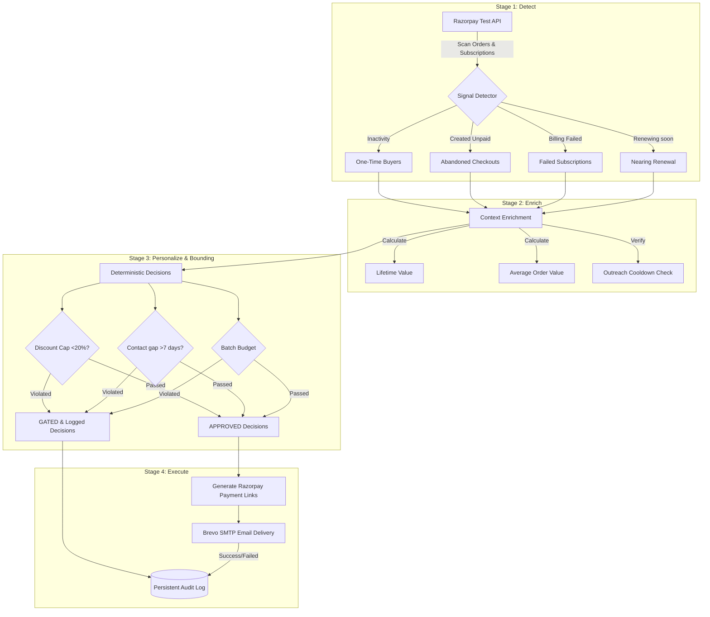

# RevivePay — Merchant Revenue Recovery & Growth Agent

RevivePay is an autonomous agent designed for the **Razorpay AI Buildathon (Track 01: AI Growth & Agentic Commerce)**. It plugs into a merchant's Razorpay account (test-mode) to continuously scan customers, orders, and subscriptions, identifying lost revenue opportunities. 

For every opportunity it finds, the agent personalizes recovery offers (discount coupons, checkout link nudges, billing alerts), validates them against strict safety bounding gates (discount caps, batch budget limits, contact frequency cool-downs), generates secure payment links, and executes campaigns via Brevo email delivery.

---

## 🚀 Architecture & Pipeline Flow

The agent runs a structured 4-stage pipeline: **Detect &rarr; Enrich &rarr; Personalize/Gate &rarr; Execute**.



---

## 🔒 Bounding Gates & Safety Checks (The Judging Bar)

To ensure high corporate compliance and safety, every money-touching decision is validated against rigid thresholds defined in `src/config.js` before executing:

1. **Max Discount Percentage Cap:** Hard limit on discount rates (Default: `20%`). Rejects any higher proposed discounts.
2. **Batch Spend Cap Limit:** Cumulative budget ceiling across a run (Default: `INR 300`). Rejects further discounts if cumulative spend is exceeded.
3. **Outreach Frequency Cap:** Ensures no customer is contacted more than once every `N` days (Default: `7 days`) by auditing the persistent log records.
4. **Safety Checkpoint Prompt (`--safety`):** Opt-in CLI confirm gate. Displays all approved actions in a preview table and waits for interactive confirmation before executing.
5. **Robust Error Handling:** Catches API timeouts or SMTP connection drops (e.g., Sarah D'Souza's simulated delivery failure), logging them as `FAILED` in the audit log while allowing the rest of the batch to run smoothly.

---

## 🛠️ Technology Stack

* **Runtime:** Node.js (CommonJS modules for broad compatibility).
* **Payment API:** Razorpay Node API (Basic Auth).
* **Outreach API:** Brevo SMTP API.
* **CLI Engine:** `commander` for command options, `inquirer` for safety confirmation.
* **Theme Styling:** `picocolors` for terminal markup.

---

## ⚙️ Setup & Installation

### 1. Prerequisites
Ensure you have **Node.js** (v16+) installed.

### 2. Install Dependencies
```bash
npm install
```

### 3. Configure Environment Variables
Create a `.env` file in the root directory (refer to `.env.example`):
```env
# Razorpay Test Keys
RAZORPAY_KEY_ID=rzp_test_your_key_id
RAZORPAY_KEY_SECRET=your_key_secret

# Outreach (Brevo API)
BREVO_API_KEY=xkeysib-your_brevo_api_key
SENDER_EMAIL=contact@yourmerchant.com
SENDER_NAME="Your Merchant Store"
```
*(If Razorpay/Brevo API keys are missing, the agent runs automatically in **Simulation/Mock mode**, executing the full pipeline using synthetic data).*

---

## 🏃 CLI Commands & Usage

```bash
node index.js [options]
```

### Options:
* `-m, --mock`: Runs in Simulation mode with synthetic Razorpay customers (default if keys are absent).
* `-l, --live`: Tries to connect to live Razorpay Test-mode endpoints using `.env` credentials.
* `-s, --safety`: Enables the interactive Safety Checkpoint table and Y/N confirm prompt before sending.
* `-c, --config <path>`: Load a custom JSON configuration file to override default caps (e.g. `--config ./output/custom_config.json`).
* `-a, --view-audit`: Outputs a beautiful ASCII table of the persistent audit logs to the terminal.
* `--no-fail`: Disables simulated SMTP timeouts in Simulation mode.

---

## 🎯 Demo Path Walkthrough

To demo the agent's core capabilities in Simulation Mode, run:

### Step 1: Clean Simulation Run
```bash
node index.js
```
* **Aravind Sharma** (One-Time Buyer) & **Deepika Roy** (Abandoned Checkout) are **APPROVED**. Deepika's Razorpay Recovery Payment Link is generated, and emails are sent.
* **Vikram Malhotra** (Failed Subscription) is **GATED** because his INR 200 discount would exceed the cumulative spend limit of INR 300 (Aravind's INR 120 + Deepika's INR 150 = INR 270).
* **Sarah D'Souza** (Subscription Renewal) is **APPROVED** but encounters a simulated SMTP/network delivery failure. The agent captures the exception, logs it as `FAILED` in the audit log, and continues.

### Step 2: Safety Checkpoint (Opt-in Gate)
```bash
node index.js --safety
```
Generates a confirmation prompt before Stage 4. Declining the prompt converts all approved actions to `GATED` and records the halt in the audit trail.

### Step 3: Cool-down Frequency Check (Live Mode)
```bash
node index.js --live
```
In Live Mode (`--live`), running immediately after a previous successful run checks persistent audit logs on disk and **GATES** outreach to customers contacted within the last 7 days cool-down period.

### Step 4: Inspect the Audit Log
Verify decision records by viewing the console table:
```bash
node index.js --view-audit
```
Or open the generated persistent logs directly:
* **JSON format:** `./output/audit_log.json`
* **Markdown format:** `./output/audit_log.md`

